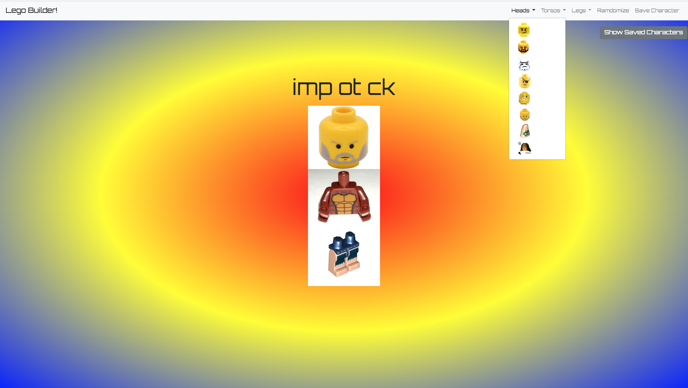
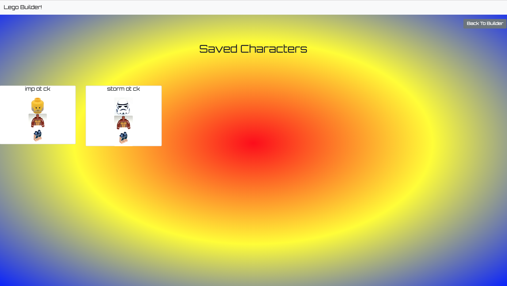

# Lego Builder

For this project we needed to access a database of lego body parts and display them. The user shouuld then be able to select new parts or randomize them and save the characters if they choose. I opted to do both selcetion and randomziation.

This assignment is inspired in part by [this pretty nifty book](https://www.youtube.com/watch?v=tDnDrO7neUE) 📖




### Technologies Used
* SASS
* Webpack
* Axios
* ES6 Modules
* Bootstrap4
* jQuery

###How to run this app
Please Note: A Firebase account is needed to run this app

1. Configure Firebase
* Clone the repository to your computer
* In your terminal ```npm install```
* Rename apiKeys.json.example to apiKeys.json in the db folder
* Create a new project in Firebase
* Copy the keys from Firebase into the apiKeys.json file
* Create a realtime databse in Firebase, and start in test mode
* Import ./db/tasks.json into the Firebase database to seed data

2. Serve up the app
* Run ```npm start``` in your terminal to initiate the app.
